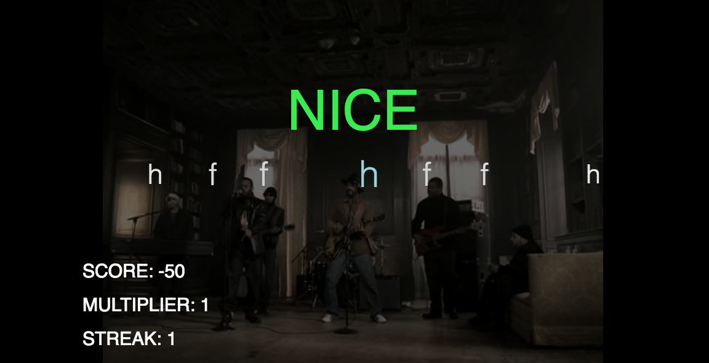

# Keyboard Drummer
A rhythm game for the browser using JavaScript, Rails and React.js.
Tap keys in time to the beat and see how high you can score!

Live: http://keyboarddrummer.herokuapp.com/
###Game View:

##Technical Details
Keyboard Drummer was built using JavaScript and React.js for the bulk of the front end components and Ruby on Rails for the backend. The database consists of two tables: Songs and Beats. Songs contain a song name and YouTube video id. Beats contain a song id, key value, and time.

On the front end, I built an internal timer to keep track of the time relative to when the video started. With this information I am able to track the current beat and compare it with the moment a user presses a key. I fetch all the beats for a particular song by making an AJAX request using the song id and rendering the beats as JSON.   

##Features
* Compose beats to any YouTube video using the Youtube IFrame API
* Select songs from menu and play against what the composer created
* Keys animate across the screen in time with the songs
* Score, multiplier, streak, and visual feedback lets you know how well you're doing

##Languages
* JavaScript
* Ruby
* HTML
* CSS

##Libraries and Technologies
* PostgreSQL
* YouTube IFrame API
* React
* Webpack
* Heroku
