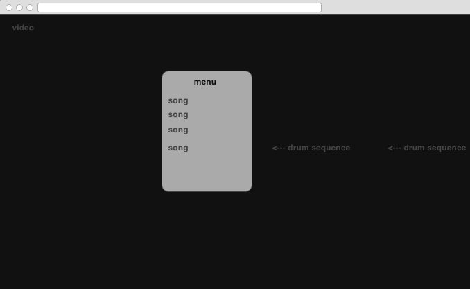

# Keyboard Drummer
A fun and easy way to play drums to your favorite songs on your computer

## Minimum Viable Product (MVP)

- Will play music and video of approximately 5 songs
- Keys will correspond to different pieces of a drum set
- User will be able to play with songs and will receive a score reflecting how well they played
- Visual cues will move across the screen and prompt users when to play

##Wireframes
###Menu/Game screen:

[]

##Backend

### tracks
column name | data type | details
------------|-----------|-----------------------
id          | integer   | not null, primary key
song        | string    | not null
drum_seq    | string    | not null
score       | string    | not null
user_seq    | string    | not null

##Implementation Timeline
Phase 1: Get video and song selection working
  -- Familiarize myself with youtube iframe Api
  -- Create databases
  -- Create launch file

Phase 2: Record proper tracks and compare with user input

Phase 3: Styling, add high scores, additional bells and whistles
